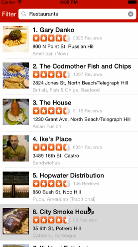

# Yelp Client

This is an iOS demo application for displaying Yelp search results using the [Yelp API](http://www.yelp.com/developers/documentation/v2/search_api). 

Time: ~10-12 hours

#### User Stories/Features:

* [x] Table rows should be dynamic height according to the content height.
* [x] Custom cells should have the proper Auto Layout constraints.
* [x] Search bar should be in the navigation bar.
* [x] The filters you should actually have are: category, sort (best match, distance, highest rated), radius (meters), deals (on/off).
* [x] The filters table should be organized into sections as in the mock.
* [x] You can use the default UISwitch for on/off states.
* [x] Radius filter should expand as in the real Yelp app
* [x] Categories should show a subset of the full list with a "See All" row to expand.
* [x] Clicking on the "Search" button should dismiss the filters page and trigger the search w/ the new filter settings.

#### Installation/Running:
```
# install dependencies
pod install

# add Yelp API keys
cd Yelp
mv Configuration.plist.example Configuration.plist
// edit plist file to include your API keys

# Open Yelp.xcworkspace in Xcode
```

#### Demo:



GIF created with [LiceCap](http://www.cockos.com/licecap/).